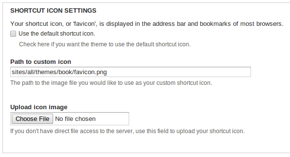
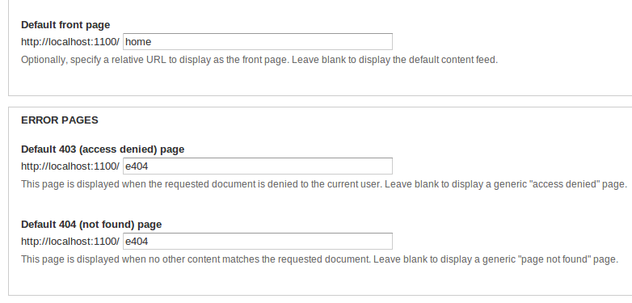
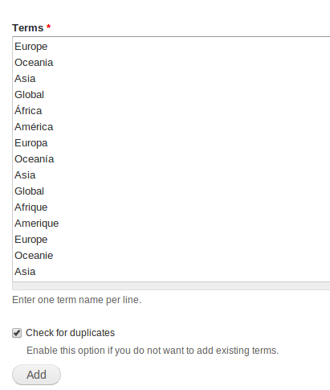

# landportal-drupal

This repository contains the *Drupal* configuration for the *LandPortal*, including
the *LandBook* and the *LandDebate*.

# Configuration instructions
Here are the instructions for configuring the *LandPortal*.  All of the following
steps can be easily followed using the *Drupal* administration interface and
require to be logged into LandPortal using an account with administrative
privileges.

## Enable the LandPortal theme
The new *LandPortal* appearance is provided by the **'book'** theme.  To enable
the **book** theme go to the tab **Appearance** in the top bar of the admin
interface.

Once in the **Appearance** tab, scroll down to the bottom of the page, and in the
section *disabled themes* click **Enable and set default** in the
*Book Theme for LandPortal*.  Now, the **book** theme is used by default in all
places except the administration view.

### Configuring the *favicon*
The *favicon* is a little icon that shows in the browser tab and in the browser
bookmark section representing the entire site.  The new LandPortal has a nice
*favicon* which can be easily enabled:  
  1. Go to **admin/appearance/settings**
  2. In the section *Logo image settings* uncheck the option *Use default logo*
  2. In the *path to custom logo* field write **sites/all/themes/book/favicon.png**

The following screenshot shows how the options shold look:

### Configuring home and error pages
The *hub* view has been designed to be the entry point to the new LandPortal.
Also, there is a nice page to show when an error occurs into the system.  To
enable those pages take the following steps:
  1. Go to **admin/config/system/site-information**
  2. In the *Default front page* text field write **home**
  3. In the *Error pages* text fields write **e404**

The following screenshot shows how the fields should be filled.

## Import the *taxonomy terms*
The *LandDebate* uses 5 different *taxonomies* or vocabularies to classify the
different contents:  
  - continents
  - countries
  - debate status
  - regions
  - topics

Each of this *taxonomies* is populated by *terms*.  Unfortunately, those *terms*
must be imported in a manual way (the import process only needs to be done once).

The following steps explain how to import the taxonomy terms:
  1. Go to **admin/structure/taxonomy**
  2. Click the button *batch add terms* for the **Continents** taxonomy.  
  3. Paste the [taxonomy terms](https://github.com/weso/landportal-drupal/blob/develop/taxonomy_terms/continents.txt)
    into the text box, and check the *check for duplicates* option.
  4. Repeat the steps with the **[countries](https://github.com/weso/landportal-drupal/blob/develop/taxonomy_terms/countries.txt)**, **[topics](https://github.com/weso/landportal-drupal/blob/develop/taxonomy_terms/topics.txt)**, **[debate status](https://github.com/weso/landportal-drupal/blob/develop/taxonomy_terms/debate_status.txt)**, **[regions](https://github.com/weso/landportal-drupal/blob/develop/taxonomy_terms/regions.txt)**, **[languages](https://github.com/weso/landportal-drupal/blob/develop/taxonomy_terms/languages.txt)**

(*Forget the "Tags" taxonomy, it is automatically created by Drupal.*)

The following screenshot shows how the import should look.

## Configure the content types
Drupal creates two content types called *Article* and *Basic page* that will not
be used into LandPortal.  Those content types can be ommited or deleted without
problem.  The content types can be accessed in **admin/structure/types**.

### Configure the *Blog posts*
The *blog posts* content type can be configured in
**admin/structure/types/manage/blog-post**.

  - Change the *preview before submitting* option to **Disabled**  
  - In the *comment settings* section uncheck the *Threading* option.  
  - In the *comment settings* section uncheck the *Allow comment title* option.  
  - In the *comment settings* section set the *Preview comment* option to **Disabled**

### Configure the *Debates*
The *debates* content type can be configured in
**admin/structure/types/manage/debate**.

  - Change the *preview before submitting* option to **Disabled**  
  - In the *comment settings* section set the *Default comment status for new content* to **Closed**
  - In the *comment settings* section set the *Preview comment* option to **Disabled**

### Configure the *Events*
The *events* content type can be configured in
**admin/structure/types/manage/event**.

  - Change the *preview before submitting* option to **Disabled**  
  - In the *comment settings* section set the *Default comment status for new content* to **Hidden**
  - In the *comment settings* section uncheck the *Threading* option.  
  - In the *comment settings* section uncheck the *Allow comment title* option.  
  - In the *comment settings* section set the *Preview comment* option to **Disabled**

### Configure the *News*
The *news* content type can be configured in
**admin/structure/types/manage/news**.  The configuration for the *news* is the
same as the configuration for the *events*, which you can see in the previous
section.

### Configure the *Organizations*
The *organization* content type can be configured in
**admin/structure/types/manage/organization**.  The configuration for the *organizations* is the
same as the configuration for the *events* and *news*, which you can see in the previous
section.

## Configure the search
The new LandPortal uses *Apache solr* to provide a high quality search service.  
The *Apache solr* configuration can be accessed in **admin/config/search/apachesolr/settings/solr/edit?destination=admin/config/search/apachesolr**.
In the *Solr server URL* field write **http://localhost:8983/solr/drupal**,
the URL in which Solr is listening

## Configure the WYSIWYG editor options
The *WYSIWYG* module allows *Drupal* to show a nice text editor component in which
the users can easily format the text and insert images.  
To edit the options go to the path *admin/config/content/wysiwyg* and for each
profile choose the editor **markItUp 1.1.14**.  
After selecting the editor you can  change its options and choose which buttons
to show.  We suggest enabling all the buttons for the best user experience.
