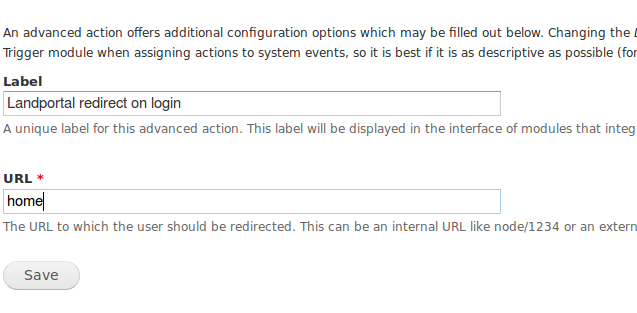
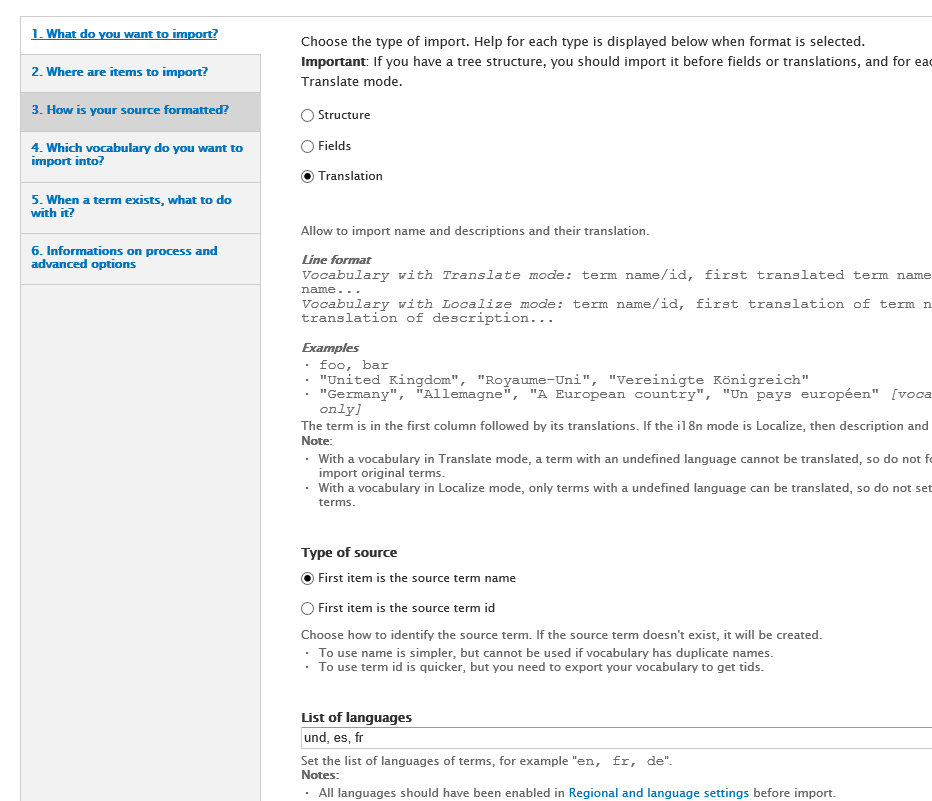
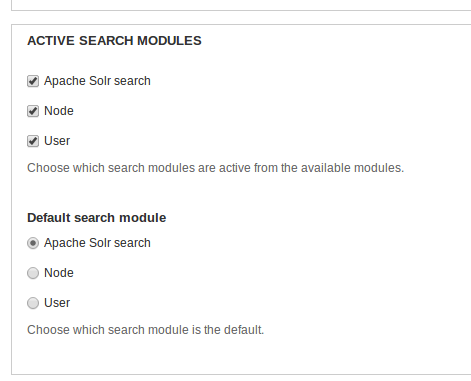

# landportal-drupal

This repository contains the *Drupal* configuration for the *LandPortal*, including
the *LandBook* and the *LandDebate*.

# Configuration instructions
Here are the instructions for configuring the *LandPortal*.  All of the following
steps can be easily followed using the *Drupal* administration interface and
require to be logged into LandPortal using an account with administrative
privileges.

## Enable the LandPortal theme
The new *LandPortal* appearance is provided by the **'book'** theme.  To enable
the **book** theme go to the tab **Appearance** in the top bar of the admin
interface.

Once in the **Appearance** tab, scroll down to the bottom of the page, and in the
section *disabled themes* click **Enable and set default** in the
*Book Theme for LandPortal*.  Now, the **book** theme is used by default in all
places except the administration view.

### Configuring the *favicon*
The *favicon* is a little icon that shows in the browser tab and in the browser
bookmark section representing the entire site.  The new LandPortal has a nice
*favicon* which can be easily enabled:  
  1. Go to **admin/appearance/settings**
  2. In the section *Shortcut icon settings* uncheck the option *Use default logo*
  2. In the *path to custom logo* field write **sites/all/themes/book/favicon.png**

The following screenshot shows how the options shold look:

### Configuring home and error pages
The *hub* view has been designed to be the entry point to the new LandPortal.
Also, there is a nice page to show when an error occurs into the system.  To
enable those pages take the following steps:
  1. Go to **admin/config/system/site-information**
  2. In the *Default front page* text field write **home**
  3. In the *Error pages* text fields write **e404**

The following screenshot shows how the fields should be filled.

### Configuring the login redirection
As stated in the previous section: the *hub* has been designed as the entry point
to the new LandPortal.  By default Drupal loads the user profile page when an
user logs into the portal, but we want to override this behaviour and redirect
the user to the *hub*.  
Two steps are required to achieve this:
  1. Go to **admin/config/system/actions**, in the bottom of the page you will
    see the page creation form.  Choose the  option *redirect to URL* in the
    dropdown and click the button *Create*.  A new page will load in which you can
    set the action label (we suggest something readable, for example
    *"Landportal redirect on login"*), in the url write **home** (the *hub* path).  
      - The following screenshot shows how the options should look.
      
  2. Go to **admin/structure/trigger/user** and select the action that we have just
    created in the *after an used has logged in* option, then click *assign*.

## Import the *taxonomy terms*
The *LandDebate* uses 5 different *taxonomies* or vocabularies to classify the
different contents:  
  - continents
  - countries
  - debate status
  - regions
  - topics

Each of this *taxonomies* is populated by *terms*.  Unfortunately, those *terms*
must be imported in a manual way (the import process only needs to be done once).

The following steps explain how to import the taxonomy terms:
  1. Go to **admin/structure/taxonomy**
  2. Click the button *CSV IMPORT* in the right upper side.  
  3. Choose **Translation** as the type of import. In the *list of languages* field put the following text **und, es, fr**.
  4. Paste the [taxonomy terms](https://github.com/weso/landportal-drupal/blob/develop/taxonomy_terms/continents.csv)
    into the text box called *terms to import*.  
  5. In the *vocabulary choice* field select the **Continents** taxonomy.  
  6. Repeat the steps with the **[countries](https://github.com/weso/landportal-drupal/blob/develop/taxonomy_terms/countries.csv)**, **[topics](https://github.com/weso/landportal-drupal/blob/develop/taxonomy_terms/topics.csv)**, **[debate status](https://github.com/weso/landportal-drupal/blob/develop/taxonomy_terms/debate_status.csv)**, **[regions](https://github.com/weso/landportal-drupal/blob/develop/taxonomy_terms/regions.csv)**, **[languages](https://github.com/weso/landportal-drupal/blob/develop/taxonomy_terms/languages.csv)**. Don't forget to select the corresponding taxonomy in each case.

(*Forget the "Tags" taxonomy, it is automatically created by Drupal. You can delete it if you want.*)

The following screenshots show how the import should look.

## Configure the content types
Drupal creates two content types called *Article* and *Basic page* that will not
be used into LandPortal.  Those content types can be ommited or deleted without
problem.  The content types can be accessed in **admin/structure/types**.

### Configure the *Blog posts*
The *blog posts* content type can be configured in
**admin/structure/types/manage/blog-post**.

  - Change the *preview before submitting* option to **Disabled**  
  - In the *comment settings* section uncheck the *Threading* option.  
  - In the *comment settings* section uncheck the *Allow comment title* option.  
  - In the *comment settings* section set the *Preview comment* option to **Disabled**

### Configure the *Debates*
The *debates* content type can be configured in
**admin/structure/types/manage/debate**.

  - Change the *preview before submitting* option to **Disabled**  
  - In the *comment settings* section set the *Default comment status for new content* to **Closed**
  - In the *comment settings* section set the *Preview comment* option to **Disabled**

### Configure the *Events*
The *events* content type can be configured in
**admin/structure/types/manage/event**.

  - Change the *preview before submitting* option to **Disabled**  
  - In the *comment settings* section set the *Default comment status for new content* to **Hidden**
  - In the *comment settings* section uncheck the *Threading* option.  
  - In the *comment settings* section uncheck the *Allow comment title* option.  
  - In the *comment settings* section set the *Preview comment* option to **Disabled**

### Configure the *News*
The *news* content type can be configured in
**admin/structure/types/manage/news**.  The configuration for the *news* is the
same as the configuration for the *events*, which you can see in the previous
section.

### Configure the *Organizations*
The *organization* content type can be configured in
**admin/structure/types/manage/organization**.  The configuration for the *organizations* is the
same as the configuration for the *events* and *news*, which you can see in the previous
section.

## Configure the search

### Connect to the *Apache Solr* service
The new LandPortal uses *Apache solr* to provide a high quality search service.  
The *Apache solr* configuration can be accessed in **admin/config/search/apachesolr/settings/solr/edit?destination=admin/config/search/apachesolr**.
In the *Solr server URL* field write **http://localhost:8983/solr/drupal**,
the URL in which Solr is listening.

### Set *Apache Solr* as the default search provider
To configure *Apache Solr* as the default search provider for the new *LandPortal*
go to **admin/config/search/settings** and in the option *Default search module*
choose the option *Apache Solr search*.

The settings should look like the following screenshot:

## Configure the WYSIWYG editor options
The *WYSIWYG* module allows *Drupal* to show a nice text editor component in which
the users can easily format the text and insert images.  
To edit the options go to the path *admin/config/content/wysiwyg* and for each
profile choose the editor **markItUp 1.1.14**.  
After selecting the editor you can  change its options and choose which buttons
to show.  We suggest enabling all the buttons for the best user experience.

## Configure Twitter and Facebook login
The HybdridAuth module allows users to sign in with their Facebook or Twitter accounts,
in order to configure this module go to the path **admin/config/people/hybridauth**.
Now, in authentication provider check Facebook and Twitter check box and then go through their settings.

**Twitter**: Follow the link provided and create a new application, you must be signed in. Fill all the gaps and paste the callback URL provided in Drupal. Then, accept developer rules and create Twitter app.
Finally you must fill the form in Drupal with the API key and API secret provided on API Keys tab.

**Facebook**: Follow the link provided and create a new application, you must be signed in. Fill the gaps for display name, namespace and category. Create the app and fill the captcha. Now, go to settings, click on advanced tab and fill Valid OAuth redirect URIs gap with your site main URL, for example: http://landportal.info. Finally return to basic tab and fill Drupal form with App ID and App Secret. In order to view the App secret you will have to type your password again.

**Note**: Facebook apps are by default in test mode so you must provide and email and then Submit Items for Approval in Status & Review section on left menu.

After all, you have to enable anonymous users permission to login with their Social Media accounts. This is done by checking first check box of Use HybridAuth option on path **admin/people/permissions**
